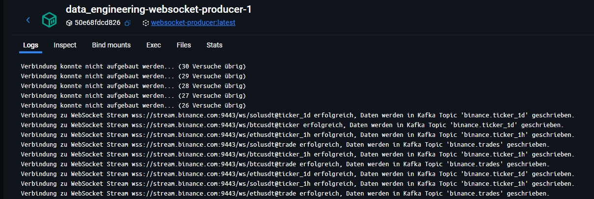
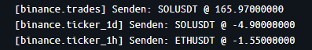
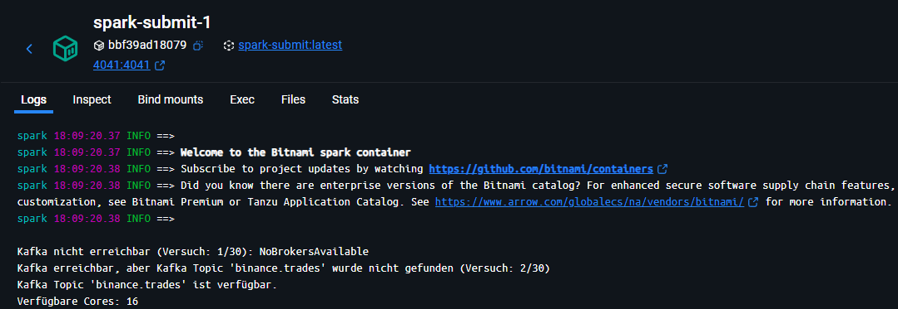
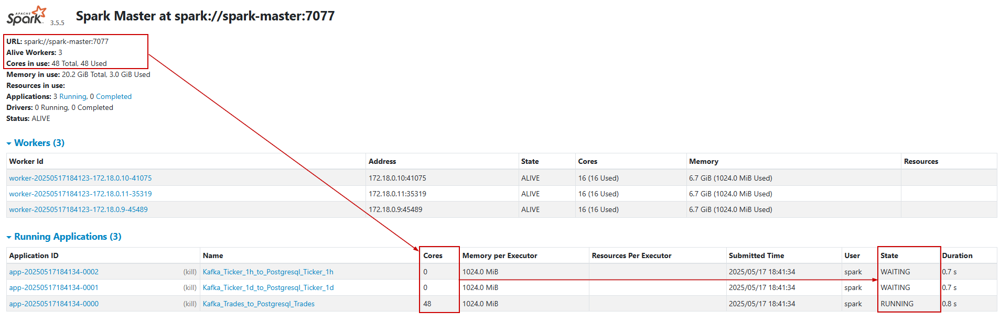

<div align="center">

# Data Engineering - Echtzeitverarbeitung von Binance WebSocket Streams

</div>

## Inhaltsverzeichnis
1. [Einleitung](#1-einleitung)
2. [Technische Rahmenbedingungen und Konzepte](#2-technische-rahmenbedingungen-und-konzepte)
   - [2.1 Komponenten der Architektur](#21-komponenten-der-architektur)   
   - [2.2 Voraussetzungen](#22-voraussetzungen)
   - [2.3 Architekturkonzeption](#23-architekturkonzeption)
3. [Datenquelle](#3-datenquelle)
   - [3.1 Binance WebSocket Streams](#31-binance-websocket-streams)
   - [3.2 Datenstruktur](#32-datenstruktur)
4. [Installationsanleitung](#4-installationsanleitung)
5. [Beispiel](#5-beispiel)
6. [Mögliche Probleme und Lösungsansätze](#6-mögliche-probleme-und-lösungsansätze)
   - [6.1 Start der Pipeline](#61-start-der-pipeline)
   - [6.2 WebSocket Producer](#62-websocket-producer)
   - [6.3 Spark](#63-spark)
   - [6.4 Prometheus](#64-prometheus)
   - [6.5 Promtail](#65-promtail)
7. [Bekannte Fehlermeldungen](#7-bekannte-fehlermeldungen)
   - [7.1 Loki - Fehlermeldung: "negative structured metadata bytes received"](#71-loki---fehlermeldung-negative-structured-metadata-bytes-received)

## 1. Einleitung

Dieses Projekt implementiert eine Echtzeit-Datenverarbeitungspipeline für Kryptodaten der Krptobörse Binance und verwendet dabei Microservices, welche in Docker Containern betrieben werden. Die Daten werden über WebSocket Streams gesendet und mittels Apache Kafka, Apache Spark und PostgreSQL verarbeitet und gespeichert. Die Visualisierung der Kryptodaten sowie des Monitorings und Loggings erfolgt über Grafana-Dashboards. Gleichzeitig werden Standards in Bezug auf Datensicherheit, Datenschutz, Data Governance, Skalierbarkeit, Zuverlässigkeit und Wartbarkeit umgesetzt. 


## 2. Technische Rahmenbedingungen und Konzepte

### 2.1 Komponenten der Architektur

**Datenerfassung und -streaming:**
- **WebSocket Producer**: Service zur Erfassung der Binance WebSocket Streams
- **Apache Kafka Broker**: Message Broker für die Datenstreamverarbeitung


**Datenverarbeitung:**
- **Spark Master**: Koordination der Spark-Verarbeitung
- **Spark Worker**: Ausführung der Datenverarbeitungsjobs
- **Spark Submit Services**: Drei separate Services für die Verarbeitung von:
  - Trade-Daten
  - aggregierte Daten der letzten Stunde (Ticker_1h)
  - aggregierte Daten des letzten Tages (Ticker_1d)

**Datenspeicherung:**
- **PostgreSQL**: Speicherung der verarbeiteten Binance Datenstreams

**Datenvisualisierung:**
- **Grafana**: Visualisierung der Datenstreams von Binance sowie von Metriken und Logs

**Monitoring und Logging:**
- **Prometheus**: Sammlung und Speicherung von Metriken der einzelnen Services
- **Postgres Exporter**: Erfassung von PostgreSQL-Metriken für das Monitoring
- **Loki**: Zentrale Log-Aggregation
- **Promtail**: Log-Sammler für Container-Logs

### 2.2 Voraussetzungen

Für die Installation und Ausführung des Projekts werden folgende Tools benötigt:
- IDE zum Beispiel VS Code
- Docker Desktop 

### 2.3 Architekturkonzeption
<div align="center">
  
</div>

## 3. Datenquelle

### 3.1 Binance WebSocket Streams
Die Binance WebSocket Streams bieten Echtzeit-Markdaten für Kryptowährungen. In diesem Projekt werden folgende Streams verwendet:

**Trade Stream:**
```
wss://stream.binance.com:9443/ws/<symbol>@trade
```
Beispiel: `wss://stream.binance.com:9443/ws/btcusdt@trade`

<br>

**Ticker Stream:**
```
wss://stream.binance.com:9443/ws/<symbol>@ticker_1h  // 1h-Ticker
```
Beispiel: `wss://stream.binance.com:9443/ws/btcusdt@ticker_1h`

<br>

```
wss://stream.binance.com:9443/ws/<symbol>@ticker     // 1d-Ticker
```
Beispiel: `wss://stream.binance.com:9443/ws/btcusdt@ticker`


<br>

### 3.2 Datenstruktur
**Trade Stream Felder:**

| Feldname | Datentyp | Beschreibung                                                                                |
|------|-----|--------------------------------------------------------------------------------------------|
| e    | String | Ereignistyp des WebSocket-Events (konstant "trade" für Handelsereignisse)                |
| E    | Long   | Zeitstempel der Eventverarbeitung auf Binance-Servern (Unix Timestamp in Millisekunden) |
| s    | String | Handelspaarsymbol in Großbuchstaben (z.B. "BTCUSDT" für Bitcoin-USDT-Handel)           |
| t    | Long   | Eindeutige Trade-ID des ausgeführten Handels auf Binance                                |
| p    | Double | Ausführungspreis des Trades in Quote Asset (USDT)                                       |
| q    | Double | Ausgeführte Handelsmenge des Base Assets (BTC, ETH, SOL)                                |
| T    | Long   | Zeitstempel der Handelsausführung (Unix Timestamp in Millisekunden)                     |
| m    | Boolean| Market Maker Flag (true = Käufer ist Market Maker, false = Verkäufer ist Market Maker)  |

<br>

**Ticker Stream Felder:**

| Feldname | Datentyp | Beschreibung                                                                                |
|------|-----|--------------------------------------------------------------------------------------------|
| e    | String | Ereignistyp des WebSocket-Events ("24hrTicker" für 24h-Ticker, "1hTicker" für 1h-Ticker) |
| E    | Long   | Zeitstempel der Eventverarbeitung auf Binance-Servern (Unix Timestamp in Millisekunden)  |
| s    | String | Handelspaarsymbol in Großbuchstaben (z.B. "BTCUSDT" für Bitcoin-USDT-Ticker)            |
| p    | Double | Absolute Preisänderung im Betrachtungszeitraum (1h oder 24h)                            |
| P    | Double | Relative Preisänderung im Betrachtungszeitraum (in Prozent)                             |
| w    | Double | Volumengewichteter Durchschnittspreis (VWAP) im Betrachtungszeitraum                    |
| c    | Double | Schlusskurs (aktueller Preis) des letzten ausgeführten Trades                           |
| Q    | Double | Handelsmenge des letzten ausgeführten Trades                                             |
| o    | Double | Eröffnungspreis zu Beginn des Betrachtungszeitraums                                     |
| h    | Double | Höchster Handelspreis im Betrachtungszeitraum                                            |
| l    | Double | Niedrigster Handelspreis im Betrachtungszeitraum                                         |
| v    | Double | Gesamtes Handelsvolumen im Base Asset (BTC, ETH, SOL)                                   |
| q    | Double | Gesamtes Handelsvolumen im Quote Asset (USDT)                                            |

## 4. Installationsanleitung

1. **Arbeitsverzeichnis vorbereiten**
   - Verzeichnis für das Projekt auswählen
   - Terminal öffnen und zu diesem Verzeichnis navigieren

2. **GitHub Repository klonen**
```
git clone https://github.com/C1emenZ/Data_Engineering.git
```

3. **In Projektverzeichnis wechseln**
```
cd Data_Engineering
```

4. **Umgebungsvariablen einrichten**
   - Die Datei `.env.beispiel` in `.env` umbenennen
   - Parameter der `.env`-Datei setzen:
     - PostgreSQL-User
     - PostgreSQL-Passwort
     - PostgreSQL-Datenbank
     - Grafana-User
     - Grafana-Passwort
5. **Services starten**
```
docker-compose up -d
```

## 5. Beispiel

Über http://localhost:3000 kann Grafana geöffnet werden. Dabei muss sich zuerst mit dem User und Passwort angemeldet werden, welches vorher in der .env-Datei gesetzt wurde.
<div align="center">
  
</div>

<br>

Um das Dashboard zu wechseln, kann die Navigation auf der linken Seite verwendet werden.
<div align="center">
  
</div>

1. **Kryptodaten:** 
Standardmäßig wird das Dashboard mit den Kryptodaten angezeigt. Über die Dropdown-Auswahl am oberen linken Rand kann die Kryptowährung geändert werden.
<div align="center">
  
</div>

<br>

2. **Monitoring-Dashboard:** 
Auf dem Monitoring Dashboard werden verschiedene Metriken angezeigt. In der ersten Reihe wird für ausgewählte Services angezeigt, ob die entsprechenden Containern aktuell laufen.
Die ersten drei Blöcke in der zweiten Zeile zeigen die Anzahl der Nachrichten pro Sekunde für das entsprechende Kafka Topic. Die drei Fenster daneben zeigen die aktuelle Anzahl der Tabelleneinträge. 
Im größereren Fenster darunter werden alle Logs der aktuell laufenden Docker Container ausgegeben.
<div align="center">
  
</div>


## 6. Mögliche Probleme und Lösungsansätze
Grundsätzlich bietet das Montoring-Dashboard einen guten Überblick für eine erste Fehleranalyse. In den Logs bzw. den Weboberflächen bestimnmter Container können zusätzlich detaillietere Informationen gefunden werden. Zum Beispiel kann über die Anzahl an Nachrichten pro Sekunde in den Kafka Topics geprüft werden, ob überhaupt Daten gesendet werden. Die Anzahl der Tabelleneinträge zeigt, ob die Verarbeitung in Spark korrekt funktiniert. Somit können mögliche Fehlerquellen schnell eingegrenzt werden. 
 
### 6.1 Start der Pipeline
Nach dem Start der Docker Container mit `docker-compose up -d` kann der Start der Pipeline über zwei Möglichkeiten überprüft werden:

1. **Terminal-Ausgabe:**
<div align="center">
  
</div>

2. **Docker Desktop Ansicht:**
<div align="center">
  
</div>


#### 6.2 WebSocket Producer
Im Log des WebSocket Producer können weitere Informationen zu den WebSocket Streams und Kafka Topics gefunden werden. Am Anfang der Verarbeitung werden alle Streams sowie Kafka Topics registriert: 
<div align="center">
  
</div>

Zusätzlich wird für jede Nachricht ein kurzer Logeintrag geschrieben. Dabei wird zuerst immer das Kafka Topic und danach ein Ausschnitt aus der eigentlichen Nachricht gesendet:
<div align="center">
  
</div>

### 6.3
Die eigentliche Datenverarbeitung findet in den Spark-Workern statt. Dabei werden die Aufgaben, welche über die Spark-Submits definiert sind über den Spark-Master an die verschiedenen Spark-Worker verteilt. Über http://localhost:8088/ kann diese Ausführung überwacht werden.
<div align="center">
  
</div>

<br>

In den Spark-Submits (http://localhost:4041/jobs/, http://localhost:4042/jobs/, ...) sieht man die eigentliche Ausführung der Streamverarbeitung. Der Job wird zwar kontinuierlich ausgeführt, die Daten werden aber in einzelnen Batches verarbeitet, welche hier angezeigt werden können.
<div align="center">
  
</div>


Beim Start der Sparkverarbeitung wird wieder ein Verbindungstest zu Kakfa gemacht und solange gewartet, bis die benötigten Kafka Topics verfügbar sind: 
Spark Submit 
<div align="center">
  
</div>

Ein mögliches Problem kann die Zuweisung an Cores zu den einzelnen Spark-Workern werden. Unter Umständen kann es dazu kommen, dass einem der Spark Worker keine Cores zugeordnet werden bzw. diese durch die anderen Spark Worker belegt werden. Dadurch kann dann die entsprechende Aufgabe nicht ausgeführt werden: 

<div align="center">
  
</div>

Prinzipiell werden die Cores dynamisch ermittelt und beim Erstellen der Sparkumgebung gesetzt. Falls 
Fehler mit der Zuweisung der Cores nicht funktioniert kann die Anzahl an folgender Stelle auch manuell gesetzt werden: <br>

`.config("spark.cores.max", cores)\` -> cores dann durch eine bestimmte Anzahl ersetzen <br>

Folgende Python-Skripte sind aktuell relevant:
- topic_binance_trades_to_postgresql_trades.py
- topic_binance_ticker_1h_to_postgresql_ticker_1h.py
- topic_binance_ticker_1d_to_postgresql_ticker_1d.py
### 6.4 Prometheus
Über http://localhost:9090/targets können alle Services überprüft werden, welche aktuell in Prometheus definiert sind und aus denen regelmäßig Metriken abgeholt werden. 
<div align="center">
  
</div>

### 6.5 Promtail
Die Logs der Container werden über Promtail gesammelt. Dabei wird zuerst das Verzeichnis definiert, welches durch Promtail überwacht werden soll. Werden neue Zeilen zu den dort gespeicherten Logdateien hinzugefügt, werden diese automatisch an Loki gesendet und dort für die Visualisierung in Grafana gespeichert. Promtail kann über http://localhost:9080/targets aufgerufen werden. 
<div align="center">
  
</div>


## 7. Bekannte Fehlermeldungen 
### 7.1 Loki - Fehlermeldung: "negative structured metadata bytes received"
Dies ist kein richtiger Fehler sondern ein bekanntes Problem in Grafana Loki und kann ignoriert werden. Weitere Informationen zu diesem Thema können hier gefunden werden: https://github.com/grafana/loki/issues/17371